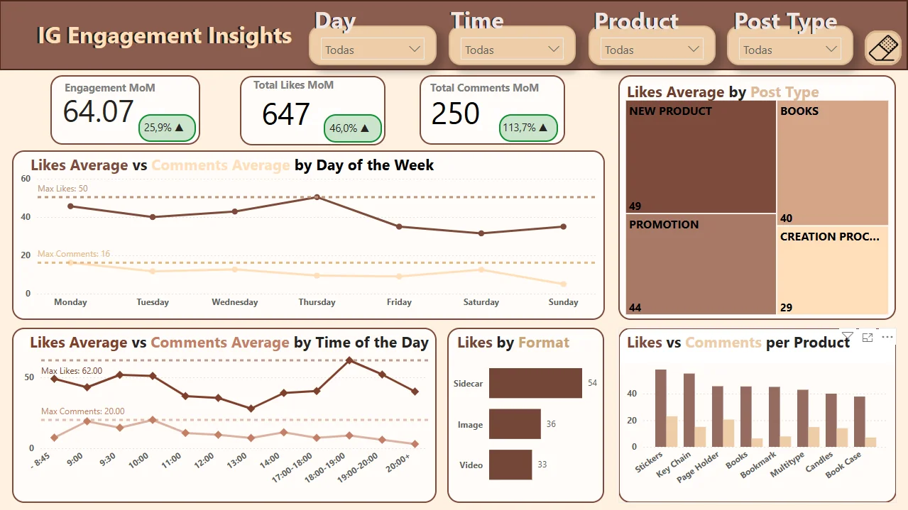

# Análisis de Mejores Horarios y Días para Publicar en Instagram

### Proyecto End-to-End de Análisis de Engagement y Ventas. Puede encontrar el dashboard interactivo [aquí](https://app.powerbi.com/groups/me/reports/235ce505-39a3-4b49-996a-6092c074d627/3523f9100989bb7d9b6e?experience=power-bi).

---
## Visión General

Este proyecto analiza datos históricos de la cuenta de Instagram de una tienda de productos literarios para identificar la mejor combinación de día y hora para publicar, maximizando el engagement, el alcance y las ventas.

Se implementa una solución completa de recopilación, procesamiento, análisis y visualización de datos, con el fin de optimizar la estrategia de contenido basada en datos.

---

## Métricas y Dimensiones Analizadas

- **Engagement:** Me gusta, comentarios, número de publicaciones.
- **Tipo de publicación:** Imagen, carrusel o vídeo.
- **Tipo de producto:** Clasificación automática mediante API de Gémini basada en hashtags y descripciones.
- **Momento de publicación:** Día de la semana y hora del día.
- **Resultados de ventas:** Correlación entre engagement y ventas estimadas.

---

## Principales Insights

### Día y Hora Óptimos

- Las publicaciones realizadas los **miércoles a las 18:00h** mostraron un **incremento del 35% en engagement** comparado con la media semanal.
- **Domingos a partir de las 20:00** también generan un **20% más de Likes** en comparación a la media del resto de días.

### Tipo de Publicación y Producto

- **Carrusel** que promocionan libros de autoayuda generaron un **47% más de interacción** que publicaciones de un solo producto.
- **Velas** tienen la mejor constancia respecto a engagement, con un **50%** más de ventas respecto al resto de productos .

### Tendencias a lo largo de la semana

- Se detectaron **caídas de engagement del 20-30% en a finales de semana**, indicando la necesidad de ajustar el contenido u horario en esos días.
- **Eventos temáticos** (San Valentín, Navidad) aumentan la interacción y ventas habitual.

---

## Resultados del Proyecto

- **Aumento esperado del engagement:** entre **20-50%** comparado a meses previos, basado en la implementación de horarios y formatos optimizados.
- **Base de datos centralizada:** Limpia y estructurada para análisis futuros automáticos.
- **Dashboards dinámicos en Power BI:** Permiten seguimiento semanal y análisis detallado por tipo de publicación, horario y producto.
- **Estrategia escalable:** Adaptable a nuevas cuentas o negocios de mayor tamaño en el futuro.
- **Impacto en ventas:** Se espera un crecimiento proporcional al aumento de engagement.

---

## Proceso de Trabajo

1. **Recopilación de datos:** Web scraping ético usando Apify para extraer estadísticas de la cuenta.
2. **Procesamiento:** Limpieza, transformación y enriquecimiento de datos en Python y PostgreSQL.
3. **Clasificación inteligente:** Implementación de Gémini API local para categorizar productos y tipos de publicaciones automáticamente.
4. **Visualización:** Desarrollo de dashboards en Power BI para ofrecer insights accionables al cliente.

---

## Recomendaciones Basadas en Datos

- Aprovechar miércoles y domingos como días clave para publicaciones de alto impacto.
- Priorizar carruseles, especialmente en lanzamientos de productos nuevos.
- Aumentar la inversión en eventos estacionales donde el engagement aumenta considerablemente.
- Ajustar la estrategia de contenido en días de baja interacción.

---

## ¿Por qué este proyecto es diferente?

A diferencia de guías genéricas basadas en datos globales, este análisis se centra en el comportamiento real de una comunidad literaria específica, ofreciendo resultados personalizados y estrategias basadas en su propia dinámica de engagement y ventas.

---
